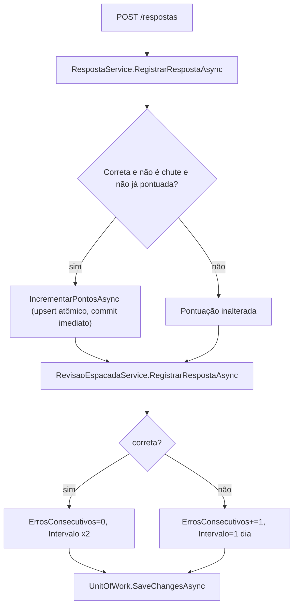
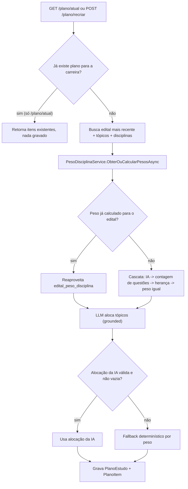

# Rastreabilidade dos Fluxos Principais — Forja

Este documento mapeia, para cada fluxo principal do sistema, o caminho completo de uma
requisição: endpoint → serviços chamados (na ordem de execução) → repositórios/tabelas
tocados → efeitos colaterais relevantes. O objetivo é permitir entender o comportamento
ponta a ponta sem precisar abrir o código-fonte.

Convenções:
- "Tabela" refere-se ao nome físico no Postgres (schema `public`), não ao nome da classe C#.
- "Serviços chamados" lista só a cadeia de orquestração relevante — validações triviais
  (ex.: parse de enum) são omitidas.
- Todo endpoint listado exige autenticação (`RequireAuthorization()`), exceto onde indicado.

---

## 1. Onboarding

**Endpoint:** `POST /onboarding`

**Serviços chamados (em ordem):**
1. `IUsuarioService.ResolverUsuarioAutenticadoAsync` — resolve o usuário autenticado a partir
   do claim `sub` do JWT; se for o primeiro acesso, provisiona o usuário a partir da
   identidade externa (Neon Auth).
2. `IOnboardingService.CompletarOnboardingAsync`:
   - Atualiza `Nivel` e `TempoDisponivelMinDia` do usuário.
   - Chama `IPlanoEstudoService.ObterOuGerarPlanoAtualAsync` (ver fluxo 4 — reaproveita plano
     existente para a carreira, ou gera um novo).

**Repositórios / tabelas tocados:**
- `IUsuarioRepository` → `usuarios` (leitura; insert se usuário novo; update de nível/tempo disponível).
- `IIdentidadeExternaRepository` → `neon_auth.user` (leitura, só no provisionamento do primeiro acesso).
- Cascata de `ObterOuGerarPlanoAtualAsync` (ver fluxo 4): `planos_estudo`, `plano_itens`,
  `editais`, `topicos`, `disciplinas`, `edital_peso_disciplina`.

**Efeito colateral relevante:**
- `usuarios.nivel` e `usuarios.tempo_disponivel_min_dia` persistidos.
- Se o usuário ainda não tinha plano para a carreira informada, um plano novo é gerado e
  gravado (mesmo efeito colateral do fluxo 4). Se já tinha, nada é gravado além da
  atualização do usuário.
- Tudo commitado numa única transação (`IUnitOfWork.SaveChangesAsync`) — mesmo quando o plano
  já existia e não precisou ser salvo de novo, o commit ainda é necessário para persistir a
  atualização do usuário.

---

## 2. Responder Questão

**Endpoint:** `POST /respostas`

**Serviços chamados (em ordem):**
1. `IUsuarioService.ResolverUsuarioAutenticadoAsync`.
2. `IRegistrarRespostaComEfeitosService.RegistrarAsync` (orquestrador):
   1. `IRespostaService.RegistrarRespostaAsync`:
      - `IQuestaoService.ObterPorIdAsync` — valida que a questão existe e está aprovada.
      - Compara resposta dada com o gabarito (case-insensitive).
      - RN-008/RN-009: só pontua na primeira resposta correta (`ExisteRespostaPontuadaAsync`)
        e nunca quando o tempo de resposta é menor que 5s (chute).
      - Se pontua: `IPontuacaoRepository.IncrementarPontosAsync` — **upsert atômico direto no
        Postgres** (não lê-soma-grava em memória), commitado imediatamente, fora da
        transação principal deste fluxo.
   2. `IRevisaoEspacadaService.RegistrarRespostaAsync` — busca ou cria o registro de revisão
      espaçada da questão e chama `RevisaoEspacada.RegistrarResultado` (RN-003, método de
      domínio): acerto zera erros consecutivos e dobra o intervalo; erro incrementa erros
      consecutivos e reseta o intervalo para 1 dia.
   3. `IUnitOfWork.SaveChangesAsync` — commit único para `RespostaUsuario` + `RevisaoEspacada`.

**Repositórios / tabelas tocados:**
- `IQuestaoRepository` → `questoes` (leitura).
- `IRespostaUsuarioRepository` → `respostas_usuario` (insert).
- `IPontuacaoRepository` → `pontuacoes` (upsert atômico, só se pontuar).
- `IRevisaoEspacadaRepository` → `revisao_espacada` (insert ou update).

**Efeito colateral relevante:**
- Pontuação incrementada **atomicamente** (10 pontos) quando a resposta pontua — commit
  imediato e independente da transação de `RespostaUsuario`/`RevisaoEspacada`. Risco aceito
  documentado no código: se o `SaveChangesAsync` do orquestrador falhar depois, o ponto já
  concedido não é revertido.
- Intervalo de revisão espaçada recalculado (RN-003).

---

## 3. Iniciar Sessão / Pomodoro

**Endpoints:**
- `POST /sessao/iniciar`
- `POST /sessao/{sessaoId}/pomodoro/iniciar`
- `POST /sessao/{sessaoId}/pomodoro/{pomodoroId}/finalizar`

### 3.1 Iniciar sessão

**Serviços chamados:** `IUsuarioService.ResolverUsuarioAutenticadoAsync` →
`IIniciarSessaoComEfeitosService.IniciarAsync`:
1. `ISessaoEstudoService.IniciarSessaoAsync` — retorna a sessão de hoje se já existir; senão cria uma nova.
2. `IStreakService.RegistrarAtividadeAsync` — atualiza a sequência de dias consecutivos.
3. `IUnitOfWork.SaveChangesAsync`.

**Tabelas:** `sessoes_estudo` (leitura + insert condicional), `streaks` (leitura + insert/update).

**Efeito colateral:** `streaks.dias_consecutivos` incrementa se a última atividade foi ontem;
reseta para 1 se houve quebra na sequência; sem mudança se a atividade de hoje já foi registrada.

### 3.2 Iniciar pomodoro

**Serviços chamados:** `IUsuarioService.ResolverUsuarioAutenticadoAsync` →
`IPomodoroService.IniciarPomodoroAsync` (valida que a sessão pertence ao usuário) → insere `Pomodoro`.

**Tabelas:** `sessoes_estudo` (leitura, valida dono), `pomodoros` (insert).

**Efeito colateral:** nenhum além da criação do registro.

### 3.3 Finalizar pomodoro

**Serviços chamados:** `IUsuarioService.ResolverUsuarioAutenticadoAsync` →
`IPomodoroService.FinalizarPomodoroAsync`:
1. Valida sessão do usuário e existência do pomodoro.
2. Se já finalizado, retorna sem efeito (idempotente).
3. Conta respostas registradas no ciclo (`IRespostaUsuarioRepository.ContarRespostasNoPomodoroAsync`).
4. RN-011: se houve pelo menos 1 resposta, concede 5 pontos via
   `IPontuacaoRepository.IncrementarPontosAsync` (upsert atômico).
5. `IUnitOfWork.SaveChangesAsync`.

**Tabelas:** `pomodoros` (update), `respostas_usuario` (leitura/contagem), `pontuacoes`
(upsert atômico, condicional).

**Efeito colateral:** pontuação incrementada atomicamente (5 pontos) somente se houve
resposta no ciclo — o timer rodar até o fim, sozinho, não pontua.

---

## 4. Gerar Plano de Estudo

**Endpoints:**
- `GET /plano/atual` — reaproveita plano existente para a carreira, ou gera um novo.
- `POST /plano/recriar` — sempre gera um novo, preservando o anterior.

**Serviços chamados (em ordem):**
1. `IUsuarioService.ResolverUsuarioAutenticadoAsync`.
2. `IPlanoEstudoService.ObterOuGerarPlanoAtualAsync` (ou `RecriarPlanoAsync`, que sempre força
   a geração e monta um resumo do plano anterior antes):
   - Se já existe plano mais recente para a carreira (`/plano/atual` apenas): retorna os itens
     existentes, sem gravar nada.
   - Senão, gera um novo plano:
     1. `IEditalRepository.GetMaisRecentePorCarreiraAsync` — edital mais recente da carreira.
     2. `ITopicoRepository.GetByEditalIdAsync` — tópicos do edital.
     3. `IDisciplinaRepository.GetByIdsAsync` — nomes das disciplinas.
     4. `IPesoDisciplinaService.ObterOuCalcularPesosAsync` — cascata de cálculo de peso por
        disciplina (só na primeira vez que o edital é referenciado):
        1. Extração via IA de distribuição quantitativa declarada no texto do edital.
        2. Contagem de questões aprovadas por disciplina (piso de amostra mínima = 10).
        3. Herança dos pesos do edital anterior mais recente da mesma carreira.
        4. Peso igual entre disciplinas (fallback final, nunca persistido).
     5. `IGeradorDeRespostaChat.PedirRespostaEstruturadaAsync` (LLM) — monta a alocação de
        tópicos por tempo, grounded para usar apenas tópicos reais do edital.
     6. Grava `PlanoEstudo` + `PlanoItem[]`; `IUnitOfWork.SaveChangesAsync`.

**Repositórios / tabelas tocados:**
- `IPlanoEstudoRepository` → `planos_estudo` (leitura + insert).
- `IPlanoItemRepository` → `plano_itens` (leitura + insert).
- `IEditalRepository` → `editais` (leitura).
- `ITopicoRepository` → `topicos` (leitura).
- `IDisciplinaRepository` → `disciplinas` (leitura).
- `IEditalPesoDisciplinaRepository` → `edital_peso_disciplina` (leitura + insert condicional,
  via `PesoDisciplinaService`).
- `IChunkConteudoRepository` / `IQuestaoRepository` → `chunks_conteudo` / `questoes` (leitura,
  usados apenas pelos casos (a) e (b) do cálculo de peso).

**Efeito colateral relevante:**
- Plano gerado via IA, sempre **grounded** contra o catálogo real de tópicos do edital — um
  tópico alucinado pela IA é descartado antes de gravar; se nenhuma alocação sobrar, cai num
  plano determinístico de reserva (ordenado por peso de disciplina), garantindo que o plano
  nunca fica vazio.
- Peso por disciplina é calculado uma única vez por edital e persistido em
  `edital_peso_disciplina` (exceto o caso de peso igual entre disciplinas, recomputado a cada
  chamada por ser barato).
- Em `/plano/recriar`, o plano anterior **nunca é removido** — só deixa de ser "o mais
  recente" (por `criado_em`).

---

## 5. Dúvida via RAG

**Endpoint:** `POST /duvidas`

**Serviços chamados (em ordem):**
1. `IQuestaoService.ObterPorIdAsync` — valida que a questão existe e está aprovada.
2. `IGeradorDeEmbeddings.GerarEmbeddingAsync` (Voyage) — embeda a pergunta do aluno.
3. `IChunkConteudoRepository.BuscarPorSimilaridadeAsync` — busca vetorial (pgvector) pelos 5
   chunks mais similares.
4. Se nenhum chunk for encontrado, retorna resposta fixa informando que não há conteúdo
   suficiente — **sem chamar o LLM**.
5. `IGeradorDeRespostaChat.GerarRespostaAsync` (Gemini, via Semantic Kernel) — instrução de
   sistema exige responder **ESTRITAMENTE** com base no contexto recuperado, sem completar
   com conhecimento próprio, e dizer explicitamente quando o contexto não for suficiente.

**Repositórios / tabelas tocados:**
- `IQuestaoRepository` → `questoes` (leitura).
- `IChunkConteudoRepository` → `chunks_conteudo` (leitura, busca por similaridade vetorial).

**Efeito colateral relevante:**
- Nenhuma escrita no banco — fluxo 100% de leitura + chamada a LLM.
- A resposta inclui os IDs dos chunks efetivamente usados como fonte (rastreabilidade/citação).

---

## 6. Submeter / Moderar Contribuição

**Endpoints:**
- `POST /contribuicoes` — submeter.
- `POST /admin/contribuicoes/{id}/aprovar` — moderar (aprovar).
- `POST /admin/contribuicoes/{id}/rejeitar` — moderar (rejeitar).
- `GET /topicos/{id}/contribuicoes` — listar aprovadas por tópico (leitura pura).

### 6.1 Submeter

**Serviços chamados:** `IUsuarioService.ResolverUsuarioAutenticadoAsync` →
`IContribuicaoService.SubmeterAsync`:
1. Valida que o tópico existe (`ITopicoRepository.GetByIdAsync`).
2. Valida que o link é uma URL absoluta válida.
3. Cria `ContribuicaoConteudo` com `Status = EmRevisao`.
4. `IUnitOfWork.SaveChangesAsync`.

**Tabelas:** `topicos` (leitura), `contribuicoes_conteudo` (insert).

**Efeito colateral:** contribuição criada sempre em revisão — nunca aprovada diretamente.

### 6.2 Aprovar

**Serviços chamados:** `IUsuarioService.ResolverUsuarioAutenticadoAsync` (resolve o moderador) →
`IContribuicaoService.AprovarAsync`:
1. Valida que o moderador é admin (`IAdminAuthorizer.EhAdmin`, por e-mail).
2. Marca a contribuição como `Aprovada`, com `ModeradoPor`/`ModeradoEm`.
3. Concede reputação: cria ou incrementa `ReputacaoContribuicao.PontosContribuicao` (+10).
4. Concede a medalha "Primeira Contribuição Aprovada" se o usuário ainda não a tiver
   (`IUsuarioMedalhaRepository.ExisteAsync`/`AddAsync`).
5. `IUnitOfWork.SaveChangesAsync`.

**Tabelas:** `usuarios` (leitura, valida admin), `contribuicoes_conteudo` (update),
`reputacao_contribuicao` (insert ou update), `usuario_medalhas` (insert condicional).

**Efeito colateral relevante:**
- Reputação incrementada (+10 pontos) — tabela distinta de `pontuacoes` (mede contribuição de
  conteúdo, não atividade de estudo).
- Medalha de marco concedida na primeira aprovação, de forma idempotente (não duplica em
  aprovações seguintes).

### 6.3 Rejeitar

**Serviços chamados:** mesma validação de admin de 6.2, mas só marca `Status = Rejeitada` —
sem reputação nem medalha.

**Tabelas:** `usuarios` (leitura), `contribuicoes_conteudo` (update).

---

## 7. Ranking Semanal

**Endpoint:** `GET /ranking/semanal`

**Serviços chamados (em ordem):**
1. `IPontuacaoService.ObterRankingSemanalAsync`:
   - Se `carreiraId` for informado: `IPlanoEstudoRepository.GetByCarreiraIdAsync` — restringe
     o ranking aos usuários com plano naquela carreira.
   - `IPontuacaoRepository.GetRankingSemanalAsync` — consulta paginada (skip/take, teto de 100
     itens), filtrada pela semana de referência atual (`Pontuacao.InicioDaSemana`), ordenada
     por `pontos_semana_atual` decrescente.
   - `IUsuarioRepository.GetByIdsAsync` — resolve os nomes exibidos no ranking.

**Repositórios / tabelas tocados:**
- `IPlanoEstudoRepository` → `planos_estudo` (leitura, só se filtrar por carreira).
- `IPontuacaoRepository` → `pontuacoes` (leitura, ordenada por semana).
- `IUsuarioRepository` → `usuarios` (leitura, nomes).

**Efeito colateral relevante:** nenhum — leitura pura e paginada.
